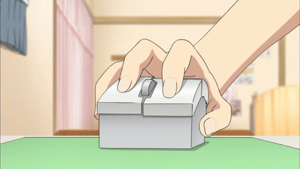

# Mouse UPBGE 2022
    
#### Essa é a padronização que sera utilizada em 2022 na criação de games na empresa ***kinguru***

## Versões UPBGE
    - UPBGE-0.30-linux-x86_64 

## Configuração Mouse **PC**

    

## Api completa 
    veja em api python

## HUD
    Painel de gerenciamento de Mouse onde sera possível a customização das teclas

## GUI
    Aqui teremos as texturas de botoes para alterar a aparência do HUD