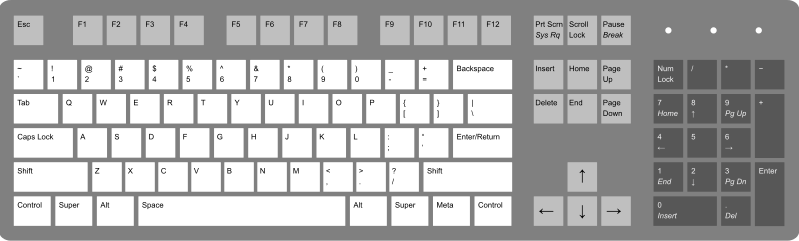
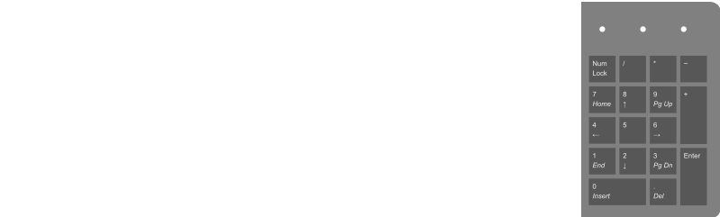
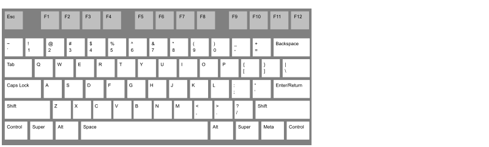

 
# keyboard UPBGE 2022
    
#### Essa é a padronização que sera utilizada em 2022 na criação de games na empresa ***kinguru***

## Versões UPBGE
    - UPBGE-0.30-linux-x86_64 

# Esta configuração atendera apenas o teclado convencional !
    

    
        Uso padrão de teclas :
        (awds | 4862 )
        a,4 = esquerda
        w,8 = cima
        d,6 = direita
        s,2 = baixo
        cada seta direcional segue sua direção Obviamente 

---
## Configuração teclado **numérico**

       
        4 = esquerda
        8 = cima
        6 = direita
        2 = baixo
    
## Configuração teclado **Alpha numérico**

    a = esquerda
    w = cima
    d = direita
    s = baixo
   

## Configuração teclado **Setas**

    
    é so usar a cabeça ;)

## Api completa 
    veja em api python

## HUD
    Painel de gerenciamento de teclado onde sera possível a customização das teclas

## GUI
    Aqui teremos as texturas de botoes para alterar a aparência do HUD