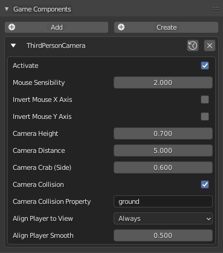

# Modelos de controlador de personagem
Esses modelos foram criados para ajudar os usuários UPBGE a criar jogos ou qualquer tipo de coisa interativa que requeira um controlador de personagem. Fácil de usar, fácil de anexar ao seu projeto.

Para usar, basta selecioná-lo no rótulo do modelo no editor de script e pronto! Você pode usar este modelo em seus projetos, mesmo para projetos comerciais. Basta dar os créditos ao Guilherme Teres Nunes (UnidayStudio) para isso. É muito fácil de usar: Basta carregar este script em seu arquivo .blend através do rótulo do modelo (ou colá-lo na mesma pasta em que está seu .blend), selecionar o objeto que deseja e anexar o script aos componentes do objeto usando Register Botão de componente .

Componente de controle de caracteres
Este componente servirá como um controlador de personagem para o seu jogo. Com isso, você pode easly fez uma jogada objeto usando W, A, S, D, correr com LSHIFTe salto com SPACE. Você simplesmente tem que criar uma cápsula para seu personagem, definir o tipo de física para “Personagem” e anexar este componente a eles. É muito simples de configurar:

Componente controlador de personagem

Ativar : se você deseja que este componente seja executado.

Velocidade de caminhada : a velocidade de caminhada do personagem.

Velocidade de corrida : a velocidade de corrida do personagem.

Saltos máximos: os saltos máximos do personagem. Defina como 0se não quiser que o personagem pule.

Direção do salto estático : Se você quiser fazer seu personagem pular em uma direção estática, ative “Direção do salto estático”. Isso significa que, se o jogador não estava se movendo quando pressionou a barra de espaço, o personagem irá pular e o jogador não poderá mudar isso durante o pulo. O mesmo para quando ele estava se movendo quando pressionou a tecla Espaço. A direção do salto será a direção do personagem quando o jogador apertar espaço.

Rotação do salto estático : Exatamente como a direção do salto, mas para a rotação do personagem.

Evitar Deslizar : Se o seu objeto de personagem tem Limites de Colisão ativados, eu recomendo habilitar a opção “Evitar Deslizar”. Nesse caso, o componente evitará que o personagem deslize nas rampas.

Movimento suave do personagem : Você pode tornar o movimento mais suave aumentando esse valor ( 0.0para 1.0).

Make Object Invisible : Torna o objeto invisível no jogo (útil se você anexar este componente a um objeto cápsula que tem uma armadura dentro).

# Componente de câmera de primeira pessoa

Este componente foi criado para ser conectado à sua câmera e dar a você um ótimo controle do mouse. Muito útil para jogos de primeira pessoa.

Para usar, adicione uma câmera em sua cena, parente-a em sua cápsula de personagem (você pode usar o componente controlador de personagem nela) e conecte este componente à câmera. Não se esqueça de posicionar a câmera em um local próximo à “cabeça” do seu personagem.

Você pode configurar a sensibilidade do mouse, inverter Xou Yeixo e habilitar / desabilitar o limite de rotação da câmera. É muito simples de configurar:

Componente de câmera de primeira pessoa

Ativar : se você deseja que este componente seja executado.

Sensibilidade do mouse : A sensibilidade do mouse.

Invert Mouse X Axis : Para inverter o mouse sobre o Xeixo.

Invert Mouse Y Axis : Para inverter o mouse sobre o Yeixo.

Limitar rotação da câmera : Limita a rotação da câmera no Xeixo local. Muito útil para jogos de primeira pessoa para evitar que a câmera vire de cabeça para baixo.

# Componente de câmera de terceira pessoa

Este componente foi criado para ser conectado à sua câmera para fornecer um ótimo controle do mouse sobre a terceira pessoa. Muito útil para jogos de aventura, RPGs, mundos abertos ou qualquer tipo de jogo que requeira uma câmera de terceira pessoa.

Para usar, adicione uma câmera em sua cena, parente-a em sua cápsula de personagem (você pode usar o componente controlador de personagem nela) e conecte este componente à câmera. E pronto! O componente fará o resto para você. :)

Você pode configurar a sensibilidade do mouse, inverter Xou Yeixo e habilitar / desabilitar o limite de rotação da câmera. É muito simples de configurar:

Ativar : se você deseja que este componente seja executado.

Sensibilidade do mouse : A sensibilidade do mouse.

Invert Mouse X Axis : Para inverter o mouse sobre o Xeixo.

Invert Mouse Y Axis : Para inverter o mouse sobre o Yeixo.

Altura da câmera : A altura que você deseja que sua câmera tenha (considere a altura zero = o centro do seu personagem).

Distância da câmera : a distância do personagem que você deseja que sua câmera fique.

Camera Crab (Side) : Você pode fazer a câmera ficar ao lado do seu personagem, se quiser. Basta ajustar esta variável.

Colisão de câmeras : se você deseja que sua câmera colida (para evitar que a câmera atravesse as paredes).

Propriedade de colisão da câmera : a propriedade que você deseja que sua câmera evite (se quiser que a câmera evite todos os objetos, deixe em branco).

Align Player to View : Você pode definir quando deseja que o jogador (personagem) olhe na direção de visão da câmera: Nunca, apenas quando o jogador se move ou sempre.

Alinhar o jogador suavemente: o quão suave você deseja que o jogador olhe na direção da câmera. 0significa não suave e 1significa o máximo possível de suavidade.

Ao usar este componente, você também pode chamar algumas funções usando python (de outros componentes) para ajudá-lo: setCameraAlign (type), setCameraPos (x, y, z), alignPlayerToView (), getCameraView (). Dê uma olhada na implementação para ver como essas funções funcionam.

## Componente de animação simples

Este componente irá alinhar automaticamente a armadura para a direção de movimento do seu personagem, executa as animações corretas de acordo com a velocidade e se o personagem está no ar ou não.

Para usar, anexe este componente à armadura de seu personagem. É importante que a armadura seja parental com um objeto cápsula com tipo físico igual a Personagem. É muito simples de configurar:

Ativar : se você deseja que este componente seja executado.

Max Walk Speed : Defina a velocidade máxima que você deseja ao executar a animação de caminhada. Após essa velocidade, o personagem começará a interpolar a animação da corrida. (Leia as notas no final).

Max Run Speed : Defina a velocidade máxima que você deseja ao executar a animação de execução. Após essa velocidade, a animação não mudará.

Suspender Física das Crianças : Ative esta opção se quiser remover toda a física das crianças da armadura (recursiva). Útil para evitar que essas crianças colidam com a cápsula do jogador, causando um bug de física.

Alinhar para a direção de movimento : Habilite se você quiser que seu personagem fique voltado para a direção para a qual o jogador está indo.

Alinhar suavemente: o quão suave você deseja alinhar o caractere com a direção. 0 significa sem suavidade e 1 significa suavidade máxima.

Animação inativa : Defina o nome da animação inativa (parada), o início e o fim do quadro.

Animação de caminhada : defina o nome da animação de caminhada, o início e o fim do quadro.

Run Animation : Defina o nome da animação Run, o início e o fim do quadro.

Jump Up Animation : Defina o nome da animação Jump Up, o início e o fim do quadro.

Animação de salto para baixo : defina o nome da animação de salto para baixo, o início e o fim do quadro. As animações de Jump devem ser divididas em duas: Jump Up e Jump Down. O primeiro será executado quando o personagem estiver subindo. A segunda, quando o personagem está caindo. Ambos devem ser animações em loop.

