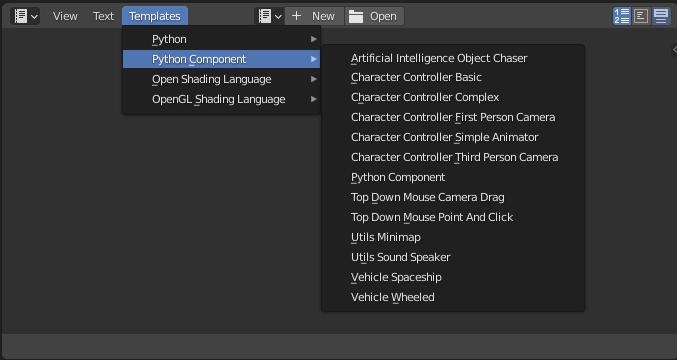

## Começando
Este subcapítulo tem como objetivo mostrar os modelos básicos de componentes do Python incluídos no UPBGE, desde os movimentos do controlador de personagens até as operações mais comuns usadas no desenvolvimento de jogos. Isso lhe dará informações importantes sobre como usar os componentes reutilizáveis, incluídos no UPBGE, em todos os seus jogos.

Os modelos de componente Python estão incluídos na opção de modelo no editor de script.

## Modelos de controlador de personagem

[Componente de controle de caracteres  "Character Controller"](./caracteres.md)  
[Componente de câmera de primeira pessoa "First Person Camera"](./fpscam.md)  
[Componente de câmera de terceira pessoa "Third Person Camera"](./tpscam.md)  
[Componente de animação simples "Simple Animator"](./simpleanimator.md)  
[Top Down Templates](./topdown.md)  
