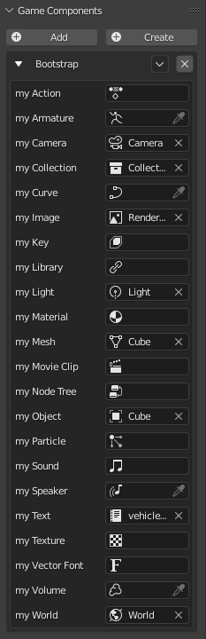
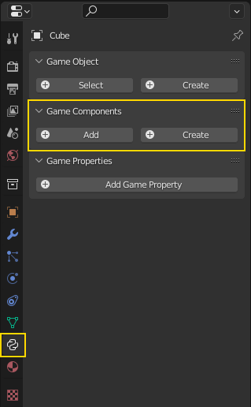
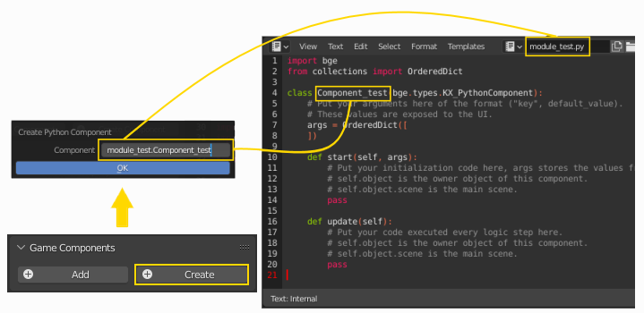

# Introdução
   Fonte: https://upbge.org/
    
 
## O que é um componente Python?

A ideia de um componente é simples. Eles são módulos que podem ser anexados a objetos do jogo. Você pode anexar quantos quiser, e cada um serve a um propósito específico, como movimento de personagem de terceira pessoa com WASD teclas. Depois que um componente é anexado a um objeto, ele pode ter várias configurações expostas que você pode editar. No caso de um componente de movimento de terceira pessoa, podem ser coisas como velocidade de movimento e velocidade de giro.

O componente Python pode ser comparado a blocos lógicos Python com parâmetros. O componente python é um script carregado na IU, esse script definiu uma classe de componente herdando de KX_PythonComponent. Esta classe deve conter um dicionário de propriedades: args e duas funções padrão: **start()** e **update()** . Além disso, o componente pode incluir uma função opcional: dispose ()

O script usado para criar o componente deve ter a extensão .py .
As propriedades do componente são carregadas do atributo args da IU no momento do carregamento. Quando o jogo começa, a função **start()** é chamada com como argumentos um dicionário do nome e valor das propriedades. A função **update()** é chamada a cada quadro durante o estágio lógico antes de executar blocos lógicos. O objetivo desta função é tratar e processar tudo.

O exemplo a seguir se move e roda componentes do objeto quando se pressiona as teclas W, A, Se D.

~~~PYTHON
import bge
from collections import OrderedDict

class ThirdPerson(bge.types.KX_PythonComponent):
   """Basic third person controls
        W: move forward
        A: turn left
        S: move backward
        D: turn right
   """

   args = OrderedDict([
         ("Move Speed", 0.1),
         ("Turn Speed", 0.04)
   ])

   def start(self, args):
      self.move_speed = args['Move Speed']
      self.turn_speed = args['Turn Speed']

   def update(self):
      keyboard = bge.logic.keyboard.events

      move = 0
      rotate = 0

      if keyboard[bge.events.WKEY]:
         move += self.move_speed
      if keyboard[bge.events.SKEY]:
         move -= self.move_speed

      if keyboard[bge.events.AKEY]:
         rotate += self.turn_speed
      if keyboard[bge.events.DKEY]:
         rotate -= self.turn_speed

      self.object.applyMovement((0, move, 0), True)
      self.object.applyRotation((0, 0, rotate), True)
~~~

Os tipos de propriedade padrão suportados são float, integer, boolean, string, set (para enumeração) e Vector 2D, 3D e 4D. O exemplo a seguir mostra todos esses tipos de propriedade:

~~~PYTHON
from bge import *
from mathutils import *
from collections import OrderedDict

class Component(types.KX_PythonComponent):
args = OrderedDict([
      ("Float", 58.6),
      ("Integer", 150),
      ("Boolean", True),
      ("String", "Cube"),
      ("Enum", {"Enum 1", "Enum 2", "Enum 3"}),
      ("Vector 2D", Vector((0.8, 0.7))),
      ("Vector 3D", Vector((0.4, 0.3, 0.1))),
      ("Vector 4D", Vector((0.5, 0.2, 0.9, 0.6)))
])

def start(self, args):
   print(args)

def update(self):
   pass
~~~

Além disso, os seguintes tipos de propriedade de dados (ID) também são suportados:

Tipos de propriedade de dados (ID) suportados
~~~PYTHON
import bge, bpy
from collections import OrderedDict

class Bootstrap(bge.types.KX_PythonComponent):
   args = OrderedDict((
      ("myAction", bpy.types.Action),
      ("myArmature", bpy.types.Armature),
      ("myCamera", bpy.types.Camera),
      ("myCollection", bpy.types.Collection),
      ("myCurve", bpy.types.Curve),
      ("myImage", bpy.types.Image),
      ("myKey", bpy.types.Key),
      ("myLibrary", bpy.types.Library),
      ("myLight", bpy.types.Light),
      ("myMaterial", bpy.types.Material),
      ("myMesh", bpy.types.Mesh),
      ("myMovieClip", bpy.types.MovieClip),
      ("myNodeTree", bpy.types.NodeTree),
      ("myObject", bpy.types.Object),
      ("myParticle", bpy.types.ParticleSettings),
      ("mySound", bpy.types.Sound),
      ("mySpeaker", bpy.types.Speaker),
      ("myText", bpy.types.Text),
      ("myTexture", bpy.types.Texture),
      ("myVectorFont", bpy.types.VectorFont),
      ("myVolume", bpy.types.Volume),
      ("myWorld", bpy.types.World),
   ))

   def start(self, args: dict):
      self.myObject = None
      if "myObject" in args:
         print("myObject = ", args["myObject"])
         self.myObject = args["myObject"]
      else:
         print("myObject not found!")

   def update(self) -> None:
      if self.myObject:
         print(self.myObject.name)
~~~

A função opcional **dispose()** é chamada quando o componente é destruído. Só é necessário em casos muito específicos.

Dentro do UPBGE existem vários modelos de componentes Python que podem nos ajudar com tarefas comuns. Iremos analisá-los nos próximos subcapítulos.

---

## Criação de componente Python

    O painel do componente Python, ou também chamado de painel do componente do jogo, 
    é colocado no editor de propriedades na guia Propriedades do objeto do jogo.

Você encontrará lá as 2 maneiras de fazer um Componente Python em UPBGE, Adicionar e Criar .

## Criar Componente

Quando você pressiona o botão Criar , um painel destacável aparecerá. Nesse painel, você pode introduzir o nome do módulo do componente e o nome da classe, ambos separados por um ponto. Após inserir o nome e clicar no botão Criar , um novo script python com o nome do módulo do componente será criado no editor de scripts. Esse script python conterá uma classe vazia cujo nome será aquele inserido anteriormente.

 
 

Conforme o script do componente é desenvolvido, você pode clicar na opção de recarregar o componente para ver o componente atualizado.

 

## Adicionar Componente

Este processo é o oposto do anterior. Em primeiro lugar, já temos um script python previamente formatado como um componente que pode ser colocado no editor de scripts ou no mesmo nível do arquivo .blend.

Ao clicar no botão **Adicionar** , teremos que inserir o nome do script python (sem o .py) seguido por um ponto e o nome da classe. Após aceitar o componente Python será criado.

