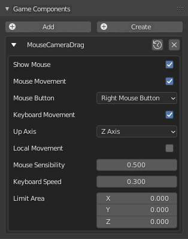

# Top Down Templates

Este template foi criado para ajudar os usuários UPBGE a criar jogos ou qualquer tipo de coisa interativa que requeira um Top Down Controller. Fácil de usar, fácil de anexar ao seu projeto.

Para usar, basta selecioná-lo no rótulo do modelo no editor de script e pronto! Você pode usar este modelo em seus projetos, mesmo para projetos comerciais. Basta dar os créditos ao Guilherme Teres Nunes (UnidayStudio) para isso. É muito fácil de usar: Basta carregar este script em seu arquivo .blend através do rótulo do modelo (ou colá-lo na mesma pasta em que está seu .blend), selecionar o objeto que deseja e anexar o script aos componentes do objeto usando Register Botão de componente .

# Componente de arrastar mouse e câmera

Este componente permitirá que o jogador mova a câmera (ou outros objetos) simplesmente segurando um botão do mouse (você decide qual botão) e arrastando o mouse. Muito útil para jogos de cima para baixo. Ele também irá permitir que o jogador para mover a câmera (ou outros objetos) pressionando W, A, S, Dchaves. Existem algumas configurações para ajudá-lo a adaptar essa lógica para melhor se adequar ao seu projeto. Se você deseja arrastar a câmera de forma vertical, para criar um jogo de rolagem lateral, por exemplo, você pode facilmente alterar o “Eixo para cima” para permitir isso. Você pode anexar este componente em sua câmera ou em outros objetos. É muito simples de configurar:

Mostrar Mouse : Habilite se quiser mostrar o mouse

Movimento do mouse : Ative se quiser ativar a lógica de arrastar do mouse

Botão do mouse : qual botão do mouse você deseja usar

Teclado Movimento : Ativar se você deseja mover o objeto usando W, A, S,D

Eixo superior : Selecione o UPeixo.

Movimento local : movimento local ou global? Você decide!

Sensibilidade do mouse : A sensibilidade do mouse!

Velocidade do teclado : Se você habilitou o movimento do teclado, controle a velocidade aqui!

Limite de área : Você pode limitar a área que o objeto pode ficar brincando com esses valores. Se não quiser, basta definir como 0.

## Componente de apontar e clicar do mouse

Este componente permitirá que você teletransporte um objeto direto para o ponto em que o jogador clica. Você pode limitar o escopo dos cliques adicionando uma propriedade. Este recurso é muito útil para jogos de cima para baixo / apontar e clicar, porque você precisa de um pivô para apontar onde o jogador deseja que o personagem vá. É muito simples de configurar:

Ativar : ativa ou desativa a lógica

Botão do mouse : qual botão do mouse você deseja usar

Alinhar ao normal : Ative se quiser alinhar o objeto com o mouse sobre o normal.

Propriedade : a propriedade com a qual você deseja interagir (deixe em branco se quiser interagir com tudo).

# Componente Object Chaser

Este componente fará com que o objeto persiga um alvo (outro objeto) quando eles tiverem certa distância. Observe que é necessário ter uma navmesh em sua cena. Você também pode alterar o objeto Target em tempo real, chamando a função setTarget (). É muito simples de configurar:

Ativar : ativa ou desativa a lógica.

Nome da navmesh : o nome da sua navmesh.

Objeto alvo : o nome do seu alvo.

Distância mínima : a distância mínima que você deseja que o objeto do alvo.

Distância de tolerância : Uma vez que o objeto já está perto do alvo, a distância de tolerância extra que eles podem ter antes de começar a perseguir novamente.

Velocidade : a velocidade do objeto enquanto persegue o alvo.

Eixo dianteiro : O eixo dianteiro (coloque o Yeixo se você não souber).

Up Axis : The UPAxis (coloque Zse você não souber).

Curva suave : Para suavizar o caminho após as curvas.